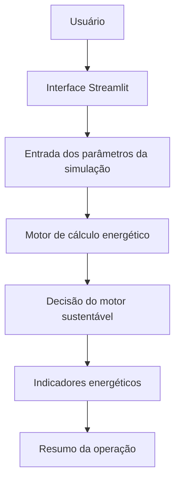
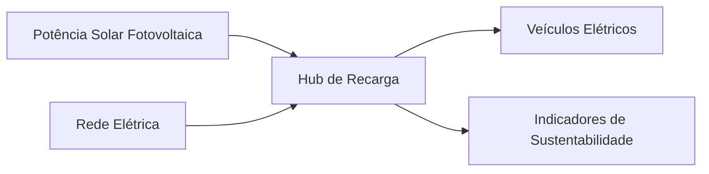

# ChargeGrid Sustentável - Prova de Conceito

Projeto desenvolvido para a **Sprint 2** da disciplina **Soluções em Energias Renováveis e Sustentáveis**, dentro do contexto do **GoodWe Challenge**.

## Sobre o Projeto

O **ChargeGrid Sustentável** é uma prova de conceito funcional que simula uma estação de recarga inteligente para veículos elétricos, considerando o uso combinado de **energia solar fotovoltaica** e **rede elétrica**.

A solução tem como objetivo demonstrar, de forma prática, como um sistema pode auxiliar no gerenciamento energético de um hub de recarga, priorizando o uso de energia renovável, reduzindo a dependência da rede elétrica e melhorando a eficiência energética da operação.

## Objetivo

Desenvolver um protótipo funcional simulado capaz de demonstrar a viabilidade técnica inicial de uma solução voltada ao carregamento sustentável de veículos elétricos.

A aplicação permite visualizar:

- demanda total dos veículos conectados;
- potência solar disponível;
- energia renovável utilizada;
- energia necessária da rede elétrica;
- percentual de atendimento por fonte renovável;
- economia estimada com uso de energia solar;
- tomada de decisão para reduzir sobrecarga em horários críticos.

## Funcionalidades

- Simulação de veículos elétricos conectados à estação;
- Configuração do horário da simulação;
- Definição da capacidade máxima da rede elétrica;
- Simulação da potência solar disponível;
- Cálculo da demanda total dos veículos;
- Cálculo da energia solar utilizada;
- Cálculo da energia necessária da rede elétrica;
- Cálculo do percentual de energia renovável utilizado;
- Estimativa de economia com energia solar;
- Ativação de modo de eficiência em cenário crítico;
- Exibição de logs técnicos simulados;
- Resumo automático da sustentabilidade da operação.

## Tecnologias Utilizadas

- Python
- Streamlit

## Arquitetura da Solução

A aplicação foi estruturada como uma simulação funcional em Python, com interface visual desenvolvida em Streamlit.

### Fluxo lógico da solução



### Fluxo energético simulado



## Lógica dos Cálculos

A prova de conceito considera que cada veículo elétrico pode demandar até **11 kW** de potência durante a recarga.

A simulação considera um período de **1 hora**, permitindo representar a energia em **kWh**.

### Demanda total dos veículos

```text
Demanda total = quantidade de veículos conectados x 11 kW
```

### Energia total no período simulado

```text
Energia total = potência consumida pelo hub x duração da simulação
```

### Energia solar utilizada

```text
Energia solar utilizada = min(potência solar disponível, potência consumida pelo hub) x duração da simulação
```

### Energia necessária da rede elétrica

```text
Energia da rede = energia total - energia solar utilizada
```

### Percentual renovável

```text
Percentual renovável = energia solar utilizada / energia total x 100
```

### Economia estimada

```text
Economia estimada = energia solar utilizada x tarifa atual.
```

A economia estimada representa o custo evitado no período simulado pelo uso da energia solar, sem considerar custos de instalação, manutenção ou depreciação do sistema fotovoltaico.

## Decisão Sustentável

O sistema avalia o cenário da estação de recarga com base em dois fatores principais:

- demanda total dos veículos;
- horário da simulação.

Quando a demanda ultrapassa a capacidade da rede elétrica ou quando a operação ocorre em horário de pico, o sistema ativa o **Modo de Eficiência**, limitando a potência por veículo para reduzir risco de sobrecarga.

Quando a operação está em condição normal, o sistema mantém a recarga em modo eficiente, priorizando o aproveitamento da energia solar disponível.

## Relação com Energias Renováveis e Sustentabilidade

O projeto está diretamente relacionado aos conceitos de energias renováveis e sustentabilidade, pois simula o uso de **energia solar fotovoltaica** como fonte complementar para o carregamento de veículos elétricos.

A solução contribui para:

- maior aproveitamento de energia renovável;
- redução da dependência da rede elétrica;
- redução de custos por meio da energia solar;
- controle de demanda em horários críticos;
- uso mais eficiente da infraestrutura elétrica;
- apoio à mobilidade elétrica sustentável.

## Dados Simulados

Os dados utilizados no sistema são simulados, mas seguem uma lógica técnica coerente com uma estação de recarga.

Exemplos de dados gerados:

- demanda total em kW;
- energia solar utilizada em kWh;
- energia consumida da rede em kWh;
- percentual de energia renovável;
- economia estimada em reais;
- status de sustentabilidade da operação.

## Como Executar o Projeto

1. Clone o repositório:

```bash
git clone https://github.com/lucaslino28/sprint2-sers-chargegrid-sustentavel.git
```

2. Acesse a pasta do projeto:

```bash
cd sprint2-sers-chargegrid-sustentavel
```

3. Instale as dependências:

```bash
python3 -m pip install -r requirements.txt
```

4. Execute a aplicação:

```bash
python3 -m streamlit run app.py
```

Após executar o comando, a aplicação será aberta no navegador.

## Estrutura do Projeto

```text
sprint2-sers-chargegrid-sustentavel/
├── app.py
├── README.md
├── requirements.txt
└── entrega_sprint2_sers.txt
```

## Evolução em Relação à Sprint 1

Na Sprint 1, a equipe apresentou a proposta conceitual da solução, demonstrando o problema e a ideia geral do sistema.

Na Sprint 2, a proposta evoluiu para uma prova de conceito funcional, permitindo simular na prática:

- funcionamento de uma estação de recarga;
- uso de energia solar fotovoltaica;
- consumo complementar da rede elétrica;
- tomada de decisão para eficiência energética;
- indicadores de sustentabilidade.

## Integrantes

- Lucas Lino Marques da Silva - RM 572863
- Bruno Riquelme Coutinho Pereira - RM 569619
- Eduardo Bigoli Portela - RM 569897
- Gabriel Martins Cordeiro Rodrigues - RM 570497
- Gustavo Fondato de Souza - RM 573651
- Gustavo Martins da Silva - RM 570584

## Observação

Este projeto é uma simulação acadêmica desenvolvida como prova de conceito. Os dados apresentados são simulados e têm o objetivo de demonstrar a lógica de funcionamento da solução, sua viabilidade técnica inicial e sua relação com eficiência energética e sustentabilidade.